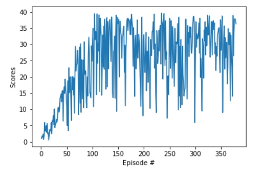

## DDPG Algorithm - Reacher Continuous Control (Version 1)

### Model Architecture
In this project, DDPG code that is provided in PyTorch is used (One agent - version 1).

Two deep neural networks (actor-critic) are used in the algorithm:

In summary these two deep neural structure are as below (See model.py):

- Actor    
    - Hidden: (input, 128)  
    - Hidden: (128, 128)    
    - Output: (128, 4)      

- Critic
    - Hidden: (input, 128)              
    - Hidden: (132, 128)  
    - Output: (128, 1)                  

DDPG Algorithm
The Agent is included in ddpg_agent algorithm and ipon reaching a reward value of 33.0, it returns
the score and the final episode.

### Hyperparameters
BUFFER_SIZE = int(1e5)  # replay buffer size
BATCH_SIZE = 128        # minibatch size
GAMMA = 0.99            # discount factor
TAU = 1e-3              # for soft update of target parameters
LR_ACTOR = 1e-4         # learning rate of the actor 
LR_CRITIC = 2e-4        # learning rate of the critic
WEIGHT_DECAY = 0.0001   # L2 weight decay

## Results
An average score of 30.10 is achieved at 379 episode.

